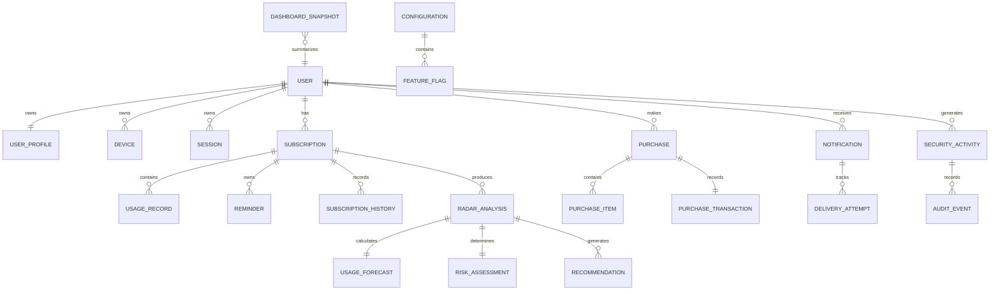

Excellent. This section establishes the **governing rules** for every Entity Relationship Diagram that follows. It is intentionally independent of SQL implementation details and focuses on consistency, ownership, and domain boundaries.

Save the following as:

`docs/04.3-Entity-Relationship-Diagram.md`

---

# Milestone 01.4 Part 03 – Section 01

# ERD Design Principles & High-Level Platform ERD

**Project:** YouStayOn

**Version:** 1.0

**Status:** Architecture Baseline – Master ERD

---

# 1. Purpose

This document defines the architectural standards governing the Entity Relationship Diagrams (ERDs) for YouStayOn.

It establishes:

* ERD notation standards
* Aggregate boundaries
* Entity ownership semantics
* Relationship rules
* Conceptual cascade philosophy
* High-level platform ERD
* Cross-domain relationships

This document serves as the master reference for all subsequent domain-specific ERDs.

---

# 2. Design Objectives

The ERD must satisfy the following goals:

* Represent business reality accurately.
* Preserve Domain-Driven Design (DDD) boundaries.
* Prevent cyclic ownership.
* Minimize coupling.
* Support future expansion without structural redesign.
* Enable straightforward conversion into Laravel migrations.
* Maintain database normalization while allowing future optimization.

---

# 3. Modeling Principles

The following principles apply throughout the platform.

## 3.1 Aggregate Ownership

Every entity belongs to exactly one aggregate.

Only the aggregate root may be referenced directly from outside the aggregate.

Child entities are accessed through their owning aggregate.

Example:

```text
User
 ├── User Profile
 ├── Device
 └── Session
```

External domains reference **User**, not **Device** or **Session**.

---

## 3.2 Single Source of Truth

Every business concept has exactly one authoritative owner.

Examples:

* User identity belongs only to the Identity domain.
* Subscription lifecycle belongs only to the Subscription domain.
* Purchases belong only to the Purchase domain.
* Radar calculations belong only to Radar Intelligence.

Other domains reference these concepts rather than duplicating them.

---

## 3.3 Explicit Relationships

All relationships must be explicitly represented.

No implicit or hidden associations are permitted.

Every relationship must define:

* Cardinality
* Ownership
* Optionality
* Lifecycle dependency

---

## 3.4 No Cross-Aggregate Child Ownership

Child entities cannot be owned by multiple aggregates.

Incorrect:

```text
User
 └── Reminder

Subscription
 └── Reminder
```

Correct:

```text
Subscription
 └── Reminder
```

The User accesses reminders through Subscriptions.

---

## 3.5 Composition over Inheritance

Variation is modeled through:

* Composition
* Configuration
* Strategy Pattern
* Enums
* Reference entities

Database inheritance hierarchies are intentionally avoided.

---

# 4. ERD Notation Standards

The following notation conventions are adopted.

## Entities

Represent business objects.

Example:

```text
User
Subscription
Purchase
```

---

## Relationships

| Symbol | Meaning                                                      |
| ------ | ------------------------------------------------------------ |
| 1      | Exactly one                                                  |
| 0..1   | Optional one                                                 |
| 1..N   | One to many                                                  |
| 0..N   | Optional many                                                |
| N..M   | Many to many (must be resolved through associative entities) |

---

## Ownership

Solid relationship:

* Aggregate ownership

Referenced relationship:

* Cross-aggregate reference

---

## Associative Entities

All many-to-many relationships are resolved through explicit entities.

Example:

```text
User
      \
       UserRole
      /
Role
```

---

# 5. Aggregate Boundaries

The platform consists of the following aggregates.

| Aggregate Root           | Aggregate Members                               |
| ------------------------ | ----------------------------------------------- |
| User                     | Profile, Device, Session, Tokens                |
| Subscription             | Usage Record, Reminder, History                 |
| Purchase                 | Purchase Item, Transaction, Provider Response   |
| Notification             | Delivery Attempt                                |
| Radar Analysis           | Forecast, Risk Assessment, Recommendation       |
| Dashboard Snapshot       | KPI Summary, Activity Summary                   |
| Security Activity        | Audit Event, Login History                      |
| Configuration            | Feature Flags, Provider Configuration, Settings |
| Wallet (Future)          | Wallet Transactions                             |
| AI Conversation (Future) | Prompts, Responses                              |

No aggregate may directly modify another aggregate's internal entities.

---

# 6. Relationship Rules

The following rules govern all logical relationships.

## Rule 1

Aggregate roots may reference other aggregate roots.

Example:

Subscription → User

---

## Rule 2

Child entities cannot reference sibling aggregates directly.

Example:

Usage Record cannot directly reference Purchase.

---

## Rule 3

Derived entities never become ownership roots.

Example:

Dashboard Snapshot is generated from:

* Subscription
* Purchase
* Notification

It never owns those entities.

---

## Rule 4

Audit entities observe business entities but never own them.

---

## Rule 5

Configuration entities are shared references and do not participate in transactional ownership.

---

# 7. Ownership Semantics

Ownership determines lifecycle responsibility.

| Parent            | Child            |
| ----------------- | ---------------- |
| User              | User Profile     |
| User              | Device           |
| User              | Session          |
| Subscription      | Usage Record     |
| Subscription      | Reminder         |
| Subscription      | History          |
| Purchase          | Purchase Item    |
| Purchase          | Transaction      |
| Notification      | Delivery Attempt |
| Radar Analysis    | Recommendation   |
| Security Activity | Audit Event      |

Deleting or archiving a parent conceptually governs the lifecycle of its owned children, subject to the retention rules defined later in the physical schema.

---

# 8. Conceptual Cascade Philosophy

Cascade behavior is defined conceptually before physical implementation.

## Composition

Owned entities follow the lifecycle of their parent.

Examples:

* User Profile
* Reminder
* Delivery Attempt

---

## Reference

Referenced entities are independent.

Examples:

* Provider
* Plan
* Role
* Permission

Deleting a referenced entity requires governance rather than cascading removal.

---

## Immutable Records

Historical records are never physically removed through cascading.

Examples:

* Purchase Transaction
* Audit Event
* Login History

Retention policies will govern these entities.

---

# 9. Cross-Domain Communication

Domains communicate through:

* Aggregate references
* Domain events
* Application services

Domains do **not** directly manipulate each other's child entities.

Example:

```text
Purchase

      │

Event

      ▼

Notification

      │

Event

      ▼

Security Audit
```

---

# 10. High-Level Platform ERD (ASCII)

```text
                           +----------------------+
                           | Identity & Access    |
                           |----------------------|
                           | User                |
                           | Profile             |
                           | Device              |
                           | Session             |
                           +----------+----------+
                                      |
                                      | 1:N
                                      |
             +------------------------+------------------------+
             |                        |                        |
             v                        v                        v
+----------------------+   +----------------------+   +----------------------+
| Subscription         |   | Purchase             |   | Notification         |
|----------------------|   |----------------------|   |----------------------|
| Subscription         |   | Purchase            |   | Notification         |
| Usage Record         |   | Purchase Item       |   | Delivery Attempt     |
| Reminder             |   | Transaction         |   | Preference           |
| History              |   | Provider Response   |   | Template            |
+----------+-----------+   +----------+-----------+   +----------+-----------+
           |                          |                          |
           |                          |                          |
           v                          |                          |
+----------------------+              |                          |
| Radar Intelligence  |              |                          |
|----------------------|              |                          |
| Radar Analysis      |              |                          |
| Forecast            |              |                          |
| Risk Assessment     |              |                          |
| Recommendation      |              |                          |
+----------+-----------+              |                          |
           \                          |                         /
            \                         |                        /
             \________________________|_______________________/
                                      |
                                      v
                         +--------------------------+
                         | Dashboard                |
                         |--------------------------|
                         | Dashboard Snapshot       |
                         | KPI Summary              |
                         | Activity Summary         |
                         +------------+-------------+
                                      |
                                      |
                                      v
                         +--------------------------+
                         | Security                 |
                         |--------------------------|
                         | Security Activity        |
                         | Login History            |
                         | Audit Event             |
                         +------------+-------------+
                                      |
                                      |
                                      v
                         +--------------------------+
                         | Administration           |
                         |--------------------------|
                         | Administrator            |
                         | Configuration            |
                         | Feature Flags            |
                         +------------+-------------+
                                      |
                                      |
                                      v
                      +--------------------------------------+
                      | Future Modules                       |
                      |--------------------------------------|
                      | Wallet                               |
                      | Savings                              |
                      | Loans                                |
                      | Insurance                            |
                      | Investments                          |
                      | Rewards                              |
                      | Referrals                            |
                      | AI Assistant                         |
                      +--------------------------------------+
```

---

# 11. High-Level Platform ERD (Mermaid)

````markdown

````

---

# 12. Aggregate Boundary Map

```text
Identity
└── User
    ├── Profile
    ├── Device
    └── Session

Subscription
└── Subscription
    ├── Usage
    ├── Reminder
    └── History

Purchase
└── Purchase
    ├── Item
    ├── Transaction
    └── Provider Response

Notification
└── Notification
    └── Delivery Attempt

Radar
└── Radar Analysis
    ├── Forecast
    ├── Risk Assessment
    └── Recommendation

Security
└── Security Activity
    └── Audit Event

Configuration
└── Configuration
    ├── Feature Flag
    ├── Provider Configuration
    └── System Settings
```

---

# 13. Implementation Guardrails

The following rules are mandatory:

* No entity may belong to multiple aggregates.
* Child entities are never referenced externally.
* Every cross-domain reference targets an aggregate root.
* Many-to-many relationships must use associative entities.
* Derived entities are never authoritative.
* Immutable records are retained according to audit policy.
* Future modules must extend rather than modify existing aggregate boundaries.

---

# 14. Deliverables Produced

This section establishes:

* ERD notation standards
* Aggregate ownership model
* Relationship rules
* Conceptual cascade philosophy
* High-level platform ERD (ASCII)
* High-level platform ERD (Mermaid)
* Aggregate boundary map
* Cross-domain interaction principles

These standards govern every domain-specific ERD that follows.

---

## ✅ Completion Checklist

* ERD notation standardized.
* Aggregate boundaries defined.
* Ownership semantics documented.
* Relationship rules established.
* Conceptual cascade philosophy approved.
* High-level platform ERD completed in ASCII and Mermaid.
* Aggregate boundary map documented.

---

## 🧪 Review Checklist

Before proceeding to domain-specific ERDs:

* Confirm every bounded context appears in the high-level ERD.
* Verify aggregate roots are the only cross-domain reference points.
* Ensure no child entity crosses aggregate boundaries.
* Validate that future modules attach to existing aggregates without restructuring them.

---

## 📝 Recommended Git Commit Message

```bash
git add .
git commit -m "docs: add Milestone 01.4 Part 03 Section 01 master ERD and design principles"
```

---

# ▶ Next Prompt

```text
Proceed with Milestone 01.4 Part 03 Section 02 – Identity & Access Domain ERD. Produce the complete Entity Relationship Diagram for the Identity & Access bounded context, including User, User Profile, Devices, Sessions, Personal Access Tokens, Roles, Permissions, User Roles, Role Permissions, authentication lifecycle relationships, ownership semantics, conceptual cascade behaviors, Mermaid ERD, relationship matrix, and implementation notes. This ERD will become the definitive blueprint for the authentication and authorization schema.
```

### One architectural refinement before implementation

To support long-term scalability and future enterprise capabilities, I recommend introducing a **Tenant** aggregate **only when multi-tenancy becomes a requirement**, rather than including it in the MVP schema now. Designing the current ERD around single-tenant ownership (one platform, many users) keeps the MVP simpler while leaving a clear extension point if organizations or white-label deployments are added later. This follows our YAGNI principle without compromising future extensibility.
