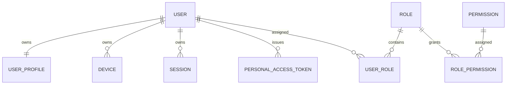

Excellent. This is the first **domain-level ERD** and it defines the foundation for every authenticated request in YouStayOn. Every other bounded context depends on the **Identity & Access** model, so we will design it to be secure, extensible, and aligned with Laravel Sanctum and our DDD architecture.

Save this as an extension to:

`docs/04.3-Entity-Relationship-Diagram.md`

---

# Milestone 01.4 Part 03 – Section 02

# Identity & Access Domain ERD

**Project:** YouStayOn

**Version:** 1.0

**Status:** Architecture Baseline – Identity & Access ERD

---

# 1. Purpose

This section defines the Entity Relationship Diagram (ERD) for the **Identity & Access** bounded context.

It establishes the conceptual schema for:

* User identity
* Authentication
* Authorization
* User devices
* Sessions
* API tokens
* Roles and permissions

This ERD serves as the blueprint for the authentication and authorization implementation in Laravel and Flutter.

---

# 2. Scope

The Identity & Access bounded context includes the following logical entities:

### Aggregate Root

* User

### Owned Entities

* User Profile
* Device
* Session
* Personal Access Token

### Reference Entities

* Role
* Permission

### Associative Entities

* User Role
* Role Permission

---

# 3. Aggregate Boundary

```text
User
│
├── User Profile
├── Device
├── Session
└── Personal Access Token

Role
│
└── Role Permission

User
│
└── User Role
```

Only the **User** aggregate root may be referenced directly by other bounded contexts.

---

# 4. Entity Responsibilities

## User

Represents a platform account.

Responsibilities:

* Authentication identity
* Account lifecycle
* Account status
* Email verification
* Password management
* Security ownership

Owns:

* Profile
* Devices
* Sessions
* Personal Access Tokens

---

## User Profile

Stores personal information separated from authentication data.

Examples:

* Display name
* Avatar
* Phone number
* Country
* Timezone
* Preferred language

Profile data changes independently from authentication credentials.

---

## Device

Represents a trusted device.

Examples:

* Android
* iPhone
* Tablet
* Web browser

Tracks:

* Device fingerprint
* Push notification token
* Last active timestamp
* Trust status

---

## Session

Represents an authenticated login session.

Tracks:

* Login time
* Logout time
* IP address
* User agent
* Last activity
* Session status

---

## Personal Access Token

Represents Laravel Sanctum authentication tokens.

Tracks:

* Token purpose
* Expiration
* Revocation status
* Last usage

---

## Role

Defines business roles.

Examples:

* User
* Administrator
* Super Administrator
* Support Agent (future)

Roles contain no user-specific information.

---

## Permission

Represents a single system capability.

Examples:

* View Dashboard
* Create Subscription
* Purchase Airtime
* Purchase Data
* Manage Users
* View Audit Logs

Permissions remain reusable across roles.

---

## User Role

Associative entity linking Users and Roles.

Supports:

* Multiple roles per user
* Future enterprise permissions

---

## Role Permission

Associative entity linking Roles and Permissions.

Allows dynamic authorization without code changes.

---

# 5. Relationship Matrix

| Parent     | Child                 | Cardinality | Mandatory |
| ---------- | --------------------- | ----------- | --------- |
| User       | User Profile          | 1 : 1       | Yes       |
| User       | Device                | 1 : N       | No        |
| User       | Session               | 1 : N       | No        |
| User       | Personal Access Token | 1 : N       | No        |
| User       | User Role             | 1 : N       | No        |
| Role       | User Role             | 1 : N       | No        |
| Role       | Role Permission       | 1 : N       | No        |
| Permission | Role Permission       | 1 : N       | No        |

---

# 6. Authentication Lifecycle

```text
Register
        │
        ▼
Create User
        │
        ▼
Create User Profile
        │
        ▼
Assign Default Role
        │
        ▼
Issue Sanctum Token
        │
        ▼
Register Device
        │
        ▼
Create Session
```

---

# 7. Login Lifecycle

```text
Login
      │
      ▼
Validate Credentials
      │
      ▼
Security Checks
      │
      ▼
Issue Personal Access Token
      │
      ▼
Register Device Activity
      │
      ▼
Create Session
      │
      ▼
Update Last Login
```

---

# 8. Logout Lifecycle

```text
Logout
      │
      ▼
Revoke Token
      │
      ▼
Close Session
      │
      ▼
Update Device Activity
      │
      ▼
Write Audit Event
```

---

# 9. Ownership Semantics

The **User** aggregate owns:

* User Profile
* Devices
* Sessions
* Personal Access Tokens

These entities:

* Cannot exist independently.
* Are created and managed through the User aggregate.
* Are never referenced directly by external domains.

Roles and Permissions are shared reference entities and are not owned by User.

---

# 10. Conceptual Cascade Behaviors

| Parent     | Child                 | Conceptual Behavior                              |
| ---------- | --------------------- | ------------------------------------------------ |
| User       | User Profile          | Lifecycle bound                                  |
| User       | Device                | Lifecycle bound (retention policy may archive)   |
| User       | Session               | Lifecycle bound (historical retention permitted) |
| User       | Personal Access Token | Revoke then remove                               |
| Role       | User Role             | Reference cleanup                                |
| Permission | Role Permission       | Reference cleanup                                |

Historical authentication records (e.g., login history) should be retained according to audit policy rather than automatically deleted.

---

# 11. Mermaid ERD

````markdown

````

---

# 12. Relationship Diagram (ASCII)

```text
                  +----------------------+
                  |        USER          |
                  +----------------------+
                     | 1
      +--------------+--------------+---------------+
      |              |              |               |
      |              |              |               |
    1 |            1:N            1:N             1:N
      |              |              |               |
      ▼              ▼              ▼               ▼
+-------------+ +-----------+ +-----------+ +----------------------+
| USER_PROFILE| |  DEVICE   | |  SESSION  | | PERSONAL_ACCESS_TOKEN|
+-------------+ +-----------+ +-----------+ +----------------------+

      USER
        |
       1:N
        |
        ▼
   +-----------+
   | USER_ROLE |
   +-----------+
        ▲
        |
       1:N
        |
   +-----------+
   |   ROLE    |
   +-----------+
        |
       1:N
        |
        ▼
+-------------------+
| ROLE_PERMISSION   |
+-------------------+
        ▲
        |
       1:N
        |
+-------------------+
| PERMISSION        |
+-------------------+
```

---

# 13. Security Considerations

The Identity & Access model must support:

* Laravel Sanctum
* Password hashing
* Email verification
* Device trust
* Session revocation
* Token expiration
* Role-based authorization (RBAC)
* Policy and Gate enforcement
* Future MFA integration

Authentication data and profile data remain logically separated.

---

# 14. Future Expansion

The design intentionally supports:

* Multi-factor authentication (MFA)
* OAuth providers
* Social login
* Enterprise SSO
* Passkeys/WebAuthn
* Device risk scoring
* Session anomaly detection
* Organization/Tenant memberships (future)
* Fine-grained permission scopes

These capabilities can be introduced without restructuring the aggregate.

---

# 15. Implementation Notes

When translated into the physical schema:

* The User entity will become the primary authentication model.
* Personal Access Token will map to Laravel Sanctum's token model (extended where necessary).
* Roles and Permissions should be implemented using our own domain model unless we explicitly adopt a package such as Spatie Laravel Permission.
* All authentication-related business logic must flow through the Identity domain services and repositories.
* Authorization decisions should be enforced using Policies and Gates, not controllers.

---

# 16. Deliverables Produced

This section defines:

* Identity & Access aggregate
* Entity responsibilities
* Authentication lifecycle
* Relationship matrix
* Ownership semantics
* Conceptual cascade behavior
* Mermaid ERD
* ASCII ERD
* Future extensibility guidance

This becomes the authoritative blueprint for the authentication schema.

---

## ✅ Completion Checklist

* User aggregate defined.
* Owned entities identified.
* Role/Permission model established.
* Authentication lifecycle documented.
* Relationship cardinality validated.
* Ownership semantics confirmed.
* Mermaid and ASCII ERDs completed.
* Security and future expansion considerations documented.

---

## 🧪 Review Checklist

Before proceeding to the next domain ERD:

* Confirm that only `User` is exposed across bounded contexts.
* Verify all authentication artifacts (profile, devices, sessions, tokens) remain inside the User aggregate.
* Ensure RBAC is fully configuration-driven and does not rely on hardcoded roles or permissions.
* Validate compatibility with Laravel Sanctum, Policies, and Gates.

---

## 📝 Recommended Git Commit Message

```bash
git add .
git commit -m "docs: add Milestone 01.4 Part 03 Section 02 Identity & Access ERD"
```

---

# ▶ Next Prompt

```text
Proceed with Milestone 01.4 Part 03 Section 03 – Subscription Management Domain ERD. Produce the complete Entity Relationship Diagram for the Subscription Management bounded context, including Provider, Provider Capability, Provider Service, Subscription Plan, User Subscription, Usage Record, Reminder, Subscription History, renewal tracking, ownership semantics, conceptual cascade behaviors, Mermaid ERD, relationship matrix, and implementation notes. Ensure the design supports mobile data, airtime, cable TV, internet, electricity, and future utility services without requiring schema changes.
```

### Architectural refinement

I recommend introducing **Provider Capability** as a first-class reference entity in this domain. Instead of encoding whether a provider supports data, airtime, cable, electricity, or internet in application logic, capabilities become configurable records linked to providers and services. This adheres to our "no hardcoding" principle and allows onboarding new providers or utility categories through configuration rather than code changes.
