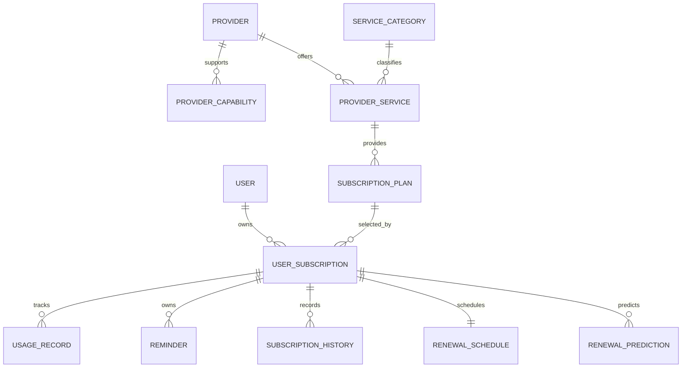

Excellent. This is arguably the **core business domain** of YouStayOn. The Subscription Management ERD must be sufficiently generic to support today's MVP (mobile data, airtime, cable TV, internet, electricity) while remaining extensible for future utility types without schema changes.

A key architectural decision carried forward is the introduction of **Provider Capability** as a first-class reference entity. Combined with **Provider Service**, this eliminates hardcoded provider logic and allows new providers or utility categories to be onboarded through configuration.

Save this as the next section in:

`docs/04.3-Entity-Relationship-Diagram.md`

---

# Milestone 01.4 Part 03 – Section 03

# Subscription Management Domain ERD

**Project:** YouStayOn

**Version:** 1.0

**Status:** Architecture Baseline – Subscription Management ERD

---

# 1. Purpose

This section defines the Entity Relationship Diagram (ERD) for the **Subscription Management** bounded context.

It establishes the conceptual schema for:

* Utility providers
* Provider capabilities
* Provider services
* Subscription plans
* User subscriptions
* Usage tracking
* Reminder scheduling
* Subscription history
* Renewal intelligence

The design is provider-agnostic and supports current and future utility services without structural redesign.

---

# 2. Aggregate Root

The aggregate root is:

* **Subscription**

Everything related to a user's managed utility lifecycle is owned or coordinated through this aggregate.

---

# 3. Entity Inventory

## Aggregate Root

* User Subscription

## Owned Entities

* Usage Record
* Reminder
* Subscription History
* Renewal Schedule (logical)
* Renewal Prediction (logical)

## Reference Entities

* Provider
* Provider Capability
* Provider Service
* Subscription Plan
* Service Category

---

# 4. Entity Responsibilities

## Provider

Represents an organization that supplies one or more utility services.

Examples:

* MTN
* Airtel
* Glo
* 9mobile
* DStv
* GOtv
* StarTimes
* Spectranet
* Smile
* IKEDC
* EKEDC

Responsibilities:

* Business identity
* Availability
* Configuration ownership
* Service catalog ownership

---

## Provider Capability

Represents a business capability offered by providers.

Examples:

* Airtime Purchase
* Data Purchase
* Cable Subscription
* Internet Subscription
* Electricity Token
* Bill Inquiry
* Usage Inquiry (future)

A provider may support many capabilities.

Capabilities are reusable across providers.

---

## Provider Service

Represents a specific service exposed by a provider.

Examples:

MTN

* SME Data
* Corporate Data
* VTU Airtime

DStv

* Compact
* Premium

Electricity

* Prepaid Token
* Postpaid Bill

A Provider owns multiple Provider Services.

---

## Service Category

Logical grouping of services.

Examples:

* Mobile Network
* Cable TV
* Internet
* Electricity
* Utility
* Financial (future)

This enables filtering and future expansion.

---

## Subscription Plan

Represents a purchasable or trackable plan.

Examples:

* 1 GB Daily
* 5 GB Weekly
* DStv Compact
* Fibre Unlimited
* Electricity Meter

Plans are provider-independent business records linked to services.

---

## User Subscription (Aggregate Root)

Represents a user's subscribed utility.

Responsibilities:

* Current status
* Start date
* Expiry date
* Auto-renew preference
* Reminder ownership
* Usage ownership
* Radar linkage

---

## Usage Record

Represents measured or entered usage information.

Examples:

* Remaining data
* Consumed data
* Estimated balance

Used by Radar Intelligence.

---

## Reminder

Represents reminder rules generated for a subscription.

Examples:

* Expiry Reminder
* Low Data Reminder
* Renewal Reminder

---

## Subscription History

Immutable historical timeline.

Examples:

* Created
* Renewed
* Suspended
* Cancelled
* Expired

---

## Renewal Schedule (Logical)

Represents renewal expectations.

Supports:

* Weekly
* Monthly
* Quarterly
* Annual
* Custom intervals

---

## Renewal Prediction (Logical)

Represents AI-generated renewal expectations.

Used by Radar Intelligence.

---

# 5. Aggregate Boundary

```text
User Subscription
│
├── Usage Record
├── Reminder
├── Subscription History
├── Renewal Schedule
└── Renewal Prediction

References:

Provider
Provider Capability
Provider Service
Subscription Plan
Service Category
```

---

# 6. Relationship Matrix

| Parent            | Child                | Cardinality | Mandatory |
| ----------------- | -------------------- | ----------- | --------- |
| Provider          | Provider Capability  | 1 : N       | Yes       |
| Provider          | Provider Service     | 1 : N       | Yes       |
| Provider Service  | Subscription Plan    | 1 : N       | Yes       |
| Service Category  | Provider Service     | 1 : N       | Yes       |
| User              | User Subscription    | 1 : N       | No        |
| Subscription Plan | User Subscription    | 1 : N       | Yes       |
| User Subscription | Usage Record         | 1 : N       | No        |
| User Subscription | Reminder             | 1 : N       | No        |
| User Subscription | Subscription History | 1 : N       | Yes       |
| User Subscription | Renewal Schedule     | 1 : 1       | No        |
| User Subscription | Renewal Prediction   | 1 : N       | No        |

---

# 7. Renewal Lifecycle

```text
Plan Selected
      │
      ▼
Subscription Created
      │
      ▼
Reminder Generated
      │
      ▼
Usage Recorded
      │
      ▼
Radar Analysis
      │
      ▼
Renewal Prediction
      │
      ▼
Notification Sent
      │
      ▼
Renewed / Expired
      │
      ▼
Subscription History Updated
```

---

# 8. Ownership Semantics

The **User Subscription** aggregate owns:

* Usage Records
* Reminder Rules
* Subscription History
* Renewal Schedules
* Renewal Predictions

Reference entities are independent and shared:

* Provider
* Provider Capability
* Provider Service
* Subscription Plan
* Service Category

No reference entity is owned by User Subscription.

---

# 9. Conceptual Cascade Behaviors

| Parent            | Child                | Behavior            |
| ----------------- | -------------------- | ------------------- |
| User Subscription | Usage Record         | Lifecycle bound     |
| User Subscription | Reminder             | Lifecycle bound     |
| User Subscription | Renewal Schedule     | Lifecycle bound     |
| User Subscription | Renewal Prediction   | Archive with parent |
| User Subscription | Subscription History | Retain for audit    |
| Provider          | Provider Service     | Governance required |
| Provider Service  | Subscription Plan    | Governance required |

Historical records should be retained rather than physically removed.

---

# 10. Mermaid ERD

````markdown

````

---

# 11. Relationship Diagram (ASCII)

```text
                        PROVIDER
                           |
            +--------------+--------------+
            |                             |
          1:N                           1:N
            |                             |
            ▼                             ▼
 PROVIDER_CAPABILITY            PROVIDER_SERVICE
                                         |
                                       1:N
                                         |
                                         ▼
                               SUBSCRIPTION_PLAN
                                         |
                                       1:N
                                         |
USER ------------------------------ USER_SUBSCRIPTION
                                         |
           +-------------+---------------+----------------+
           |             |               |                |
         1:N           1:N             1:N             1:1
           |             |               |                |
           ▼             ▼               ▼                ▼
    USAGE_RECORD     REMINDER    SUBSCRIPTION_HISTORY  RENEWAL_SCHEDULE
                                                          |
                                                        1:N
                                                          |
                                                          ▼
                                              RENEWAL_PREDICTION
```

---

# 12. Service Flexibility Model

The combination of:

* Provider
* Provider Capability
* Service Category
* Provider Service
* Subscription Plan

creates a fully dynamic utility engine.

### Example

**MTN**

Capabilities:

* Airtime
* Data

Services:

* VTU Airtime
* SME Data
* Corporate Data

Plans:

* 1 GB
* 2 GB
* 5 GB
* 10 GB

Adding a new provider requires configuration records only, not schema changes.

---

# 13. Future Expansion

The design supports future utility categories, including:

* Water utilities
* Gas services
* Waste collection
* Toll payments
* Municipal rates
* Streaming subscriptions
* Cloud services
* IoT device subscriptions

These integrate by adding new Service Categories, Provider Capabilities, Provider Services, and Plans.

---

# 14. Implementation Notes

When translated into the physical schema:

* `User Subscription` will map to the primary `subscriptions` table.
* `Provider`, `Provider Capability`, `Provider Service`, `Service Category`, and `Subscription Plan` will be reference/configuration tables seeded through migrations and seeders.
* `Usage Record` will provide the authoritative usage history for Radar Intelligence.
* Reminder generation should be handled by the Reminder Engine and persisted as child records of the subscription.
* Renewal schedules and predictions should be configurable rather than hardcoded.

---

# 15. Deliverables Produced

This section defines:

* Subscription aggregate
* Provider ecosystem
* Capability model
* Service catalog
* Subscription plan hierarchy
* Usage tracking
* Reminder ownership
* Renewal intelligence
* Relationship matrix
* Mermaid ERD
* ASCII ERD
* Future utility extensibility

This becomes the definitive blueprint for the Subscription Management schema.

---

## Architectural Decisions Finalized

* **Provider Capability** is a first-class reference entity.
* **Service Category** separates business classification from provider implementation.
* **Provider Service** acts as the reusable engine for all top-ups and subscriptions.
* **Subscription Plan** is decoupled from providers, allowing plan versioning and reuse where appropriate.
* **User Subscription** remains the sole aggregate root for user-managed utilities.
* Historical subscription events are immutable and retained for analytics and audit.

---

## ✅ Completion Checklist

* Subscription aggregate defined.
* Provider ecosystem modeled.
* Provider Capability introduced.
* Dynamic service hierarchy established.
* Renewal lifecycle documented.
* Ownership semantics validated.
* Mermaid and ASCII ERDs completed.
* Future utility support confirmed.

---

## 🧪 Review Checklist

Before proceeding:

* Verify no provider-specific logic is embedded in the schema.
* Confirm new providers and services can be onboarded through configuration only.
* Ensure reminders, usage records, and history remain inside the `User Subscription` aggregate.
* Validate that the model supports all MVP utility types and anticipated future services.

---

## 📝 Recommended Git Commit Message

```bash
git add .
git commit -m "docs: add Milestone 01.4 Part 03 Section 03 Subscription Management ERD"
```

---

# ▶ Next Prompt

```text
Proceed with Milestone 01.4 Part 03 Section 04 – Purchase & Transaction Domain ERD. Produce the complete Entity Relationship Diagram for the Purchase bounded context, including Purchase, Purchase Item, Transaction, Provider Transaction, Payment Method, Payment Attempt, Transaction Status History, Refund, Receipt, and future Wallet integration. Define ownership semantics, lifecycle states, conceptual cascade behaviors, Mermaid ERD, relationship matrix, and implementation notes. Ensure the design supports idempotent purchases, provider reconciliation, multiple payment channels, retries, refunds, and future wallet-based payments without requiring schema changes.
```

### Architectural refinement

One additional recommendation is to introduce a **Product Catalog** reference entity in a later phase that links `Provider Service` to purchasable offerings (plans, bundles, packages, tariffs). This creates a reusable catalog layer for purchases while allowing `Subscription Plan` to focus on user-tracked subscriptions. Although many plans will initially map one-to-one, separating these concepts provides greater flexibility for promotions, pricing changes, and one-off purchases without complicating the subscription model.
